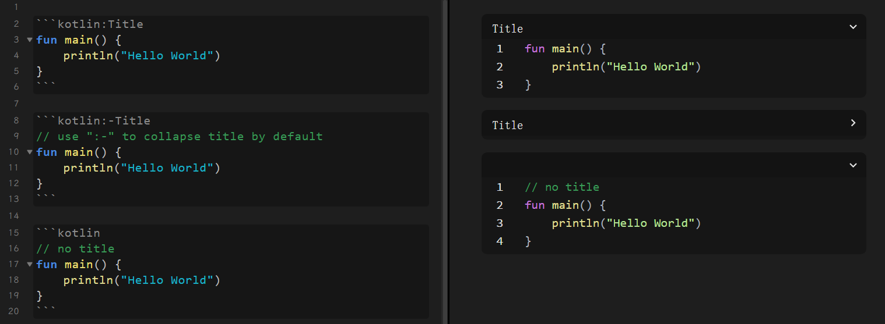
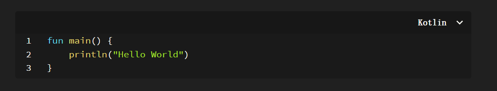

## Obsidian Better Code Block

This is a plugin for Obsidian (https://obsidian.md).

Most of the code in this plugin comes from the following two plugins (thanks to their contributions), and the icons are from Admonition.

https://github.com/tadashi-aikawa/obsidian-embedded-code-title

https://github.com/nyable/obsidian-code-block-enhancer

I have merged the code in both plugins and modified some of their functionality.

### Features
Enhancer the markdown code block in preview mode. Add title(have a bug now), line number to code blocks, you can click on the title to collapse or expand the block.

Use the syntax in the diagram below to set the block title, whether it is collapsed by default.

In version 1.0.4, add the language in the top right, like this:

### Manually installing the plugin

- Copy over `main.js`, `styles.css`, `manifest.json` to your vault `VaultFolder/.obsidian/plugins/obsidian-better-codeblock/`.
